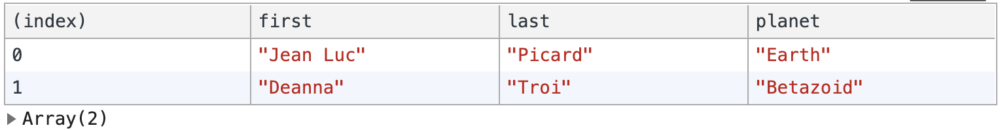

# Use console.table to display data

Display your data in your browser dev tools, terminal with `console.table`. It works great with Arrays and Objects. Instead of console.log, try console.table next time.

```javascript
const trekArray = [
  {
    first: "Jean Luc",
    last: "Picard",
    planet: "Earth"
  },
  {
    first: "Deanna",
    last: "Troi",
    planet: "Betazoid"
  }
];

console.table(trekArray);
```



---

Sources:

- https://www.samanthaming.com/tidbits/2-console-table/
